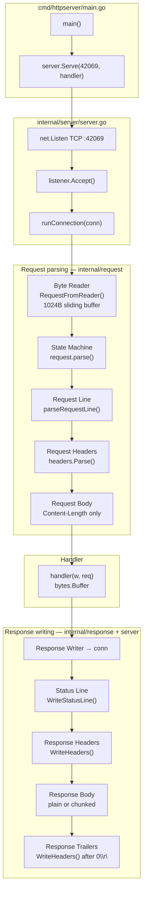
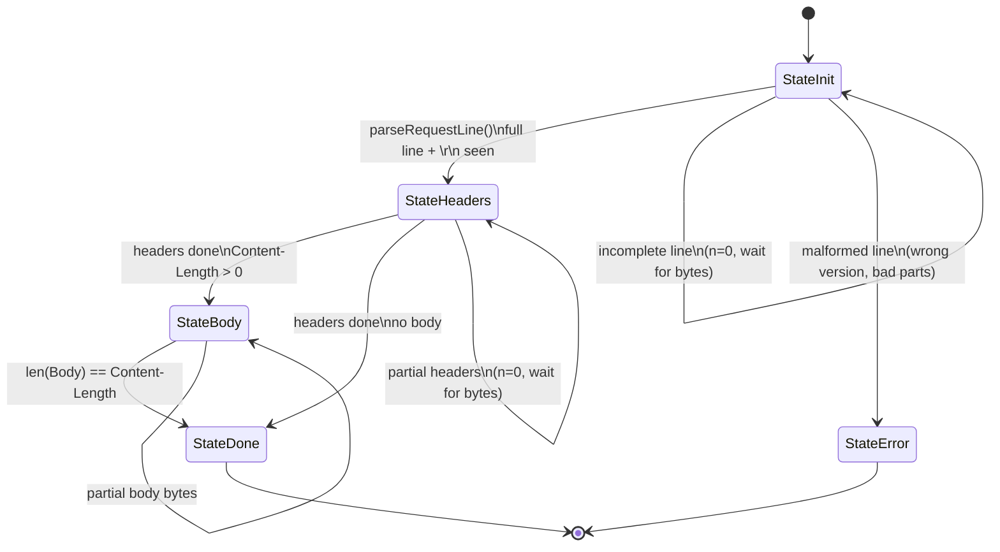
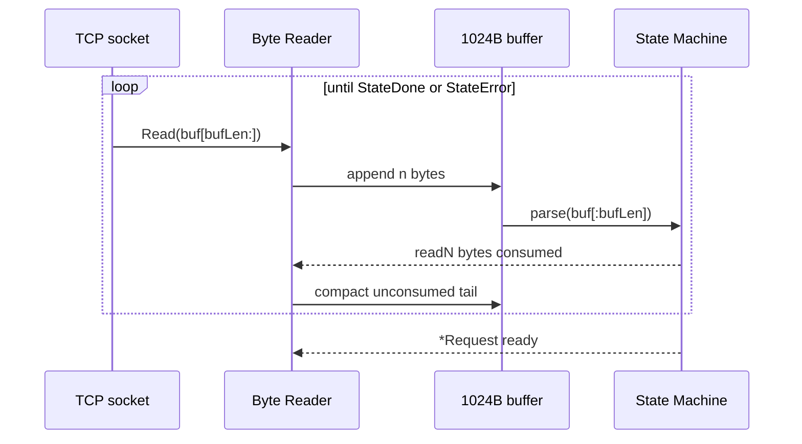
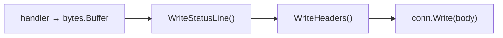
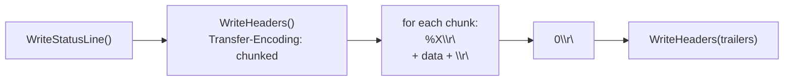
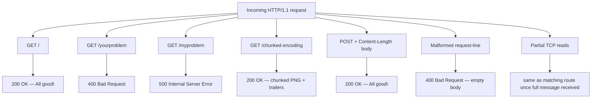
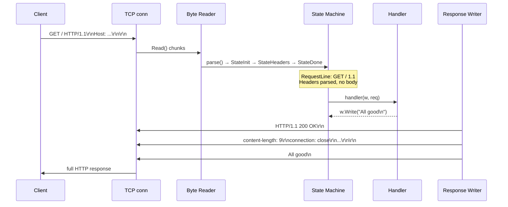

# HTTP from TCP

A minimal HTTP/1.1 server built from scratch on top of raw TCP sockets — no `net/http`. Requests are read byte-by-byte through a state machine; responses are written directly to the connection.

## Quick start

```bash
go run ./cmd/httpserver
# listens on :42069
curl http://localhost:42069/
```

## Architecture overview

Entry point: [`cmd/httpserver/main.go`](cmd/httpserver/main.go)



### Package map

| Package | File | Responsibility |
|---------|------|----------------|
| `cmd/httpserver` | `main.go` | Entry point, route handler |
| `internal/server` | `server.go` | TCP listen/accept, connection lifecycle, response orchestration |
| `internal/request` | `request.go` | Byte reader, state machine, request-line & body parsing |
| `internal/headers` | `headers.go` | Header field parsing and storage |
| `internal/response` | `response.go` | Status line and header writing |

---

## Request parsing

### State machine

[`internal/request/request.go`](internal/request/request.go) drives parsing through four states:



### Byte reader loop

TCP delivers bytes in arbitrary chunk sizes. `RequestFromReader` reads into a 1 KiB buffer and calls `parse()` until the request is complete.



**Example — 3 bytes per read** (simulated in tests via `chunkReader`):

| Read # | Bytes received | State after parse |
|--------|----------------|-------------------|
| 1 | `GET` | `StateInit` — no `\r\n` yet |
| 2 | ` /c` | `StateInit` |
| 3 | `off` | `StateInit` |
| … | … | … |
| N | ` HTTP/1.1\r\nHost: ...\r\n\r\n` | `StateDone` |

---

## Component reference

Each stage below shows the **input on the wire**, the **parsed output**, and **variations** the parser handles.

### 1. Request line — `parseRequestLine()`

**Input:**

```http
GET /coffee HTTP/1.1\r\n
```

**Output:**

```go
RequestLine{
    Method:        "GET",
    RequestTarget: "/coffee",
    HttpVersion:   "1.1",
}
// 20 bytes consumed (line + \r\n)
```

| Variation | Input | Result |
|-----------|-------|--------|
| OK | `GET /coffee HTTP/1.1\r\n` | struct above, 20 bytes read |
| Incomplete | `GET /cof` (no `\r\n`) | `n=0`, stay in `StateInit` |
| Bad version | `GET / HTTP/1.0\r\n` | `ErrorMalformedRequestLine` |
| Bad shape | `GET /coffee\r\n` (not 3 parts) | `ErrorMalformedRequestLine` |

---

### 2. Request headers — `headers.Parse()`

**Input:**

```http
Host: localhost:42069\r\n
User-Agent: curl/7.81.0\r\n
Accept: */*\r\n
\r\n
```

**Output:**

```
host         → "localhost:42069"
user-agent   → "curl/7.81.0"
accept       → "*/*"
done = true   (blank line ends headers)
```

| Variation | Input | Result |
|-----------|-------|--------|
| OK | headers + blank line | map populated, `done=true` |
| Leading spaces | `       Host: ...` | error: malformed field name |
| Duplicate key | two `Trailer:` lines | values joined with comma |

---

### 3. Request body — `StateBody`

Only `Content-Length` bodies are supported. Chunked request bodies are not implemented.

**Input:**

```http
POST /submit HTTP/1.1\r\n
Content-Length: 13\r\n
\r\n
hello world\n
```

**Output:**

```
Body  = "hello world\n"
state = StateDone
```

| Variation | Input | Result |
|-----------|-------|--------|
| No body | no `Content-Length` header | skip → `StateDone` |
| Zero length | `Content-Length: 0` | skip → `StateDone` |
| Split across reads | body arrives in multiple TCP chunks | accumulates until length met |
| Chunked request | `Transfer-Encoding: chunked` | not implemented (panics) |

---

## Response writing

### Plain response path

Used for all routes except `/chunked-encoding`.



**Wire output — `GET /`:**

```http
HTTP/1.1 200 OK\r\n
content-length: 9\r\n
connection: close\r\n
content-type: text/plain\r\n
\r\n
All good\n
```

---

### Chunked response + trailers path

Used only for `GET /chunked-encoding`. Sends a PNG image as hex-decoded chunks, then trailer headers after the terminating chunk.



**Wire output — `GET /chunked-encoding`:**

```http
HTTP/1.1 200 OK\r\n
connection: close\r\n
content-type: text/plain\r\n
transfer-encoding: chunked\r\n
trailer: X-Content-SHA256,X-Content-Length\r\n
\r\n
40\r\n
<64 bytes PNG data>\r\n
40\r\n
<64 bytes PNG data>\r\n
...
0\r\n
X-Content-SHA256: SHA256\r\n
X-Content-Length: LENGTH\r\n
\r\n
```

---

## End-to-end variations

All routes and edge cases handled by the httpserver:



| # | Route / case | Request | Response |
|---|-------------|---------|----------|
| 1 | Success | `GET / HTTP/1.1\r\nHost: localhost:42069\r\n\r\n` | `200 OK` + `All good\n` |
| 2 | Client error | `GET /yourproblem HTTP/1.1\r\n...\r\n\r\n` | `400 Bad Request` + `Whoopsie, your problem\n` |
| 3 | Server error | `GET /myproblem HTTP/1.1\r\n...\r\n\r\n` | `500 Internal Server Error` + `Whoopsie, my bad\n` |
| 4 | Chunked response | `GET /chunked-encoding HTTP/1.1\r\n...\r\n\r\n` | `200 OK` + chunked PNG + trailer headers |
| 5 | POST with body | `POST /submit HTTP/1.1\r\nContent-Length: 13\r\n\r\nhello world\n` | `200 OK` + `All good\n` |
| 6 | Parse failure | `GET / HTTP/1.0\r\n\r\n` | `400 Bad Request` + empty body |
| 7 | Incremental reads | same bytes, 1–3 bytes/read | identical outcome after full message |

### Full sequence — successful `GET /`



---

## Project layout

```
cmd/
  httpserver/   HTTP server entry point
  tcplistener/  raw TCP listener demo
  udpsender/    UDP sender demo
internal/
  server/       TCP accept loop, connection handler
  request/      byte reader, state machine, request parsing
  headers/      HTTP header parsing
  response/     status line and header writing
```

## Running tests

```bash
go test ./...
```
